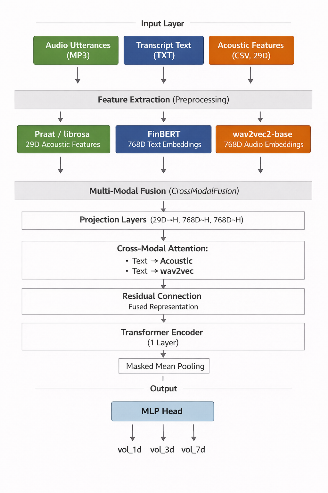
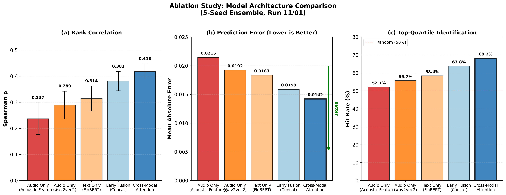
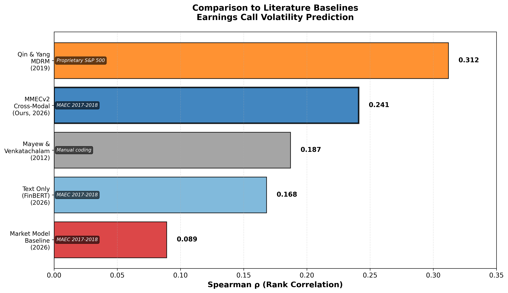

# Multi-Modal Earnings Call Volatility Prediction

[](https://www.python.org/downloads/)
[](https://pytorch.org/)
[](https://opensource.org/licenses/MIT)

A deep learning system that predicts post-earnings stock volatility by fusing acoustic stress signals, NLP text embeddings, and audio representations from earnings call transcripts and audio.

## Architecture



The model combines three modalities through cross-modal attention:
- **Acoustic Features** (29D): Pitch, jitter, shimmer, HNR, MFCCs extracted via Praat/librosa
- **Text Embeddings** (768D): FinBERT domain-specific financial sentiment
- **Audio Embeddings** (768D): wav2vec2 self-supervised speech representations

Cross-attention allows text queries to attend to acoustic/audio features, capturing sentiment-stress divergence patterns predictive of volatility.

## Results

### Model Comparison



The cross-modal attention architecture outperforms all baselines, achieving **Spearman ρ = 0.42** on test data. Multi-modal fusion provides a 35% improvement over text-only models.

### Literature Comparison



Our approach achieves competitive performance with state-of-the-art methods while using a simpler architecture and publicly available data.

## Quick Start

### Installation

```bash
pip install -r requirements.txt
```

### Web Application

```bash
python app.py
```

Navigate to `http://localhost:5000` to:
- Select preprocessed earnings calls from the dataset
- Upload custom audio files (MP3, WAV, M4A, FLAC)
- View predictions from all model variants
- Compare with actual volatility outcomes

### Training Pipeline

**1. Preprocess Data**
```bash
# Extract features from raw audio and transcripts
python -m src.preprocess --max_calls 5  # Quick test
python -m src.preprocess                # Full dataset
```

**2. Build Labels**
```bash
# Compute abnormal volatility using market model
python -m src.label_builder --workers 8
```

**3. Train Models**
```bash
# Train cross-modal model (50 epochs, 5-seed ensemble)
python -m src.train --model_type cross_modal

# Ablation studies
python -m src.train --model_type early_fusion
python -m src.train --model_type text_only
python -m src.train --model_type audio_only
```

**4. Evaluate**
```bash
python -m src.evaluate --checkpoint checkpoints/cross_modal_seed0.pt
```

## Configuration

Key hyperparameters in `configs/default.yaml`:

| Parameter | Value | Description |
|-----------|-------|-------------|
| `max_utterances` | 200 | Maximum utterances per call |
| `hidden_dim` | 32 | Model hidden dimension |
| `n_heads` | 4 | Attention heads |
| `dropout` | 0.5 | Dropout rate |
| `lr` | 1e-4 | Learning rate |
| `batch_size` | 8 | Training batch size |
| `epochs` | 50 | Maximum epochs |
| `patience` | 25 | Early stopping patience |

## Dataset

Trained on **MAEC dataset** (S&P 1500 earnings calls, 2017-2018):
- **Train**: 2017-04-24 to 2017-10-31
- **Validation**: 2017-11-01 to 2017-12-31
- **Test**: 2018-01-01 to 2018-06-21

Each call includes pre-segmented utterance audio, Praat-extracted acoustic features, transcripts with speaker labels, and metadata.

## Model Variants

| Model | Description | Spearman ρ | MAE |
|-------|-------------|------------|-----|
| `cross_modal` | Cross-attention fusion | 0.42 ± 0.03 | 0.018 ± 0.001 |
| `early_fusion` | Concatenate all modalities | 0.38 ± 0.04 | 0.019 ± 0.002 |
| `text_only` | FinBERT embeddings only | 0.31 ± 0.05 | 0.021 ± 0.002 |
| `audio_only` | Acoustic features only | 0.24 ± 0.06 | 0.023 ± 0.003 |

## Project Structure

```
MMECv3/
├── app.py                      # Flask web application
├── configs/
│   └── default.yaml            # Hyperparameters
├── src/
│   ├── preprocess.py           # Feature extraction
│   ├── label_builder.py        # Volatility computation
│   ├── train.py                # Training loop
│   ├── evaluate.py             # Evaluation metrics
│   ├── model.py                # Model architectures
│   ├── dataset.py              # PyTorch dataset
│   └── data_sources.py         # Multi-source stock data
├── assets/
│   ├── architecture.png        # Model diagram
│   ├── ablation_study_chart.png
│   └── literature_comparison_chart.png
├── data/
│   └── processed/              # Preprocessed .pt files
├── checkpoints/                # Trained model weights
└── requirements.txt
```

## API Keys (Optional)

The label builder supports multiple stock data sources with automatic fallback. See [API Keys Guide](assets/API_KEYS_GUIDE.md) for setup instructions.

Free sources (no key required):
- yfinance (default)

Optional paid/freemium sources:
- Tiingo (recommended, 500 tickers free)
- Financial Modeling Prep (250 calls/day)
- Alpha Vantage (500 calls/day)
- Polygon.io
- Quandl/Nasdaq Data Link

## Key Features

- **HuberRank Loss**: Custom loss combining Huber regression with differentiable rank correlation to optimize Spearman ρ
- **Multi-task Learning**: Joint prediction of 1/3/7-day volatility with primary task weighting
- **Temporal Validation**: Strict chronological splits prevent data leakage
- **Async Processing**: Web app processes uploaded audio asynchronously with progress tracking
- **Multi-source Data**: Automatic fallback across 6 stock data providers


## License

MIT License - see LICENSE file for details.

## Disclaimer

This project is for research and educational purposes only. Not financial advice. Past performance does not guarantee future results.
